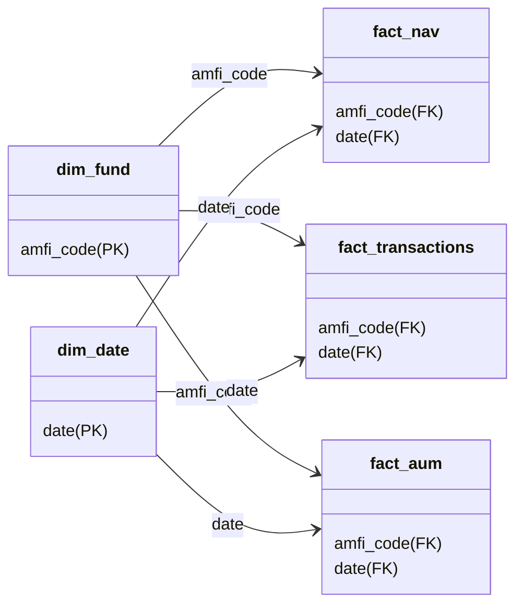

# Power BI Setup & Configuration Guide

This guide details the step-by-step setup, schemas, DAX measures, and visual properties required to construct the conformed **Bluestock Mutual Fund Analytics Dashboard** in Power BI Desktop.

---

## 1. Data Connection & Modelling
The dashboard is powered by the cleaned datasets stored in the SQLite database `bluestock_mf.db` or the conformed CSVs in the `data/processed/` directory.

### Importing Data
1. Open **Power BI Desktop**.
2. Click **Get Data** -> **Text/CSV** (or choose **ODBC** and point to the SQLite DSN).
3. Import the following 8 conformed tables:
   - `dim_fund.csv` (Fund master metadata)
   - `dim_date.csv` (Conformed date dimension)
   - `fact_nav.csv` (Expanded daily NAV time-series)
   - `fact_transactions.csv` (Investor transaction entries)
   - `fact_performance.csv` (Fund performance returns and expense ratios)
   - `fact_aum.csv` (AMC AUM levels and folio counts)
   - `fact_benchmark_indices.csv` (Daily benchmark closes for Nifty 50 and Nifty 100)

### Relationships Configuration
Switch to the **Model View** and establish the following relationships (using **1-to-Many (\*)** and **Single cross-filter direction** unless specified):



- **`dim_fund` [amfi_code]** ──1:＊──> **`fact_nav` [amfi_code]**
- **`dim_date` [date]** ──1:＊──> **`fact_nav` [date]**
- **`dim_fund` [amfi_code]** ──1:＊──> **`fact_transactions` [amfi_code]**
- **`dim_date` [date]** ──1:＊──> **`fact_transactions` [date]**
- **`dim_fund` [amfi_code]** ──1:＊──> **`fact_aum` [amfi_code]**
- **`dim_date` [date]** ──1:＊──> **`fact_aum` [date]**

---

## 2. DAX Measures & Calculations
Create a blank table named `_Measures` and implement the following conformed DAX equations:

### Page 1 - Key Performance Indicators (KPIs)
*   **Total AUM (Crore)**:
    ```dax
    Total AUM (Crore) = 
    VAR MaxDate = MAX('dim_date'[date])
    RETURN 
    CALCULATE(
        SUM('fact_aum'[aum_amount_crore]),
        'fact_aum'[date] = MaxDate
    )
    ```
*   **SIP Inflows (Crore)**:
    ```dax
    SIP Inflows (Crore) = 
    CALCULATE(
        SUM('fact_transactions'[amount_inr]),
        'fact_transactions'[transaction_type] = "SIP"
    ) / 10000000
    ```
*   **Total Folios (Crore)**:
    ```dax
    Total Folios (Crore) = 
    VAR MaxDate = MAX('dim_date'[date])
    RETURN 
    CALCULATE(
        SUM('fact_aum'[folio_count]),
        'fact_aum'[date] = MaxDate
    ) / 10000000
    ```
*   **Total Schemes**:
    ```dax
    Total Schemes = DISTINCTCOUNT('dim_fund'[amfi_code])
    ```

### Page 2 - Performance Ratios
*   **Annualized Daily Return ($Rp$)**:
    ```dax
    Annualized Return = (AVERAGE('fact_nav'[daily_return]) * 252)
    ```
*   **Annualized Volatility ($\sigma_p$)**:
    ```dax
    Annualized Volatility = STDEV.S('fact_nav'[daily_return]) * SQRT(252)
    ```
*   **Sharpe Ratio**:
    ```dax
    Sharpe Ratio = 
    VAR Rf = 0.065
    RETURN DIVIDE([Annualized Return] - Rf, [Annualized Volatility], 0)
    ```
*   **Sortino Ratio**:
    ```dax
    Sortino Ratio = 
    VAR Rf = 0.065
    VAR DownsideVol = 
        CALCULATE(
            STDEV.S('fact_nav'[daily_return]),
            'fact_nav'[daily_return] < 0
        ) * SQRT(252)
    RETURN DIVIDE([Annualized Return] - Rf, DownsideVol, 0)
    ```
*   **Tracking Error**:
    ```dax
    Tracking Error = 
    VAR FundRet = 'fact_nav'[daily_return]
    VAR BenchRet = RELATED('fact_benchmark_indices'[daily_return])
    RETURN STDEVX.S('fact_nav', FundRet - BenchRet) * SQRT(252)
    ```

---

## 3. Visual Configurations & Formatting

### Bluestock Corporate Visual Theme
To apply the Bluestock corporate color scheme, import the following JSON theme file via **View** -> **Themes** -> **Browse for themes**:

```json
{
    "name": "Bluestock Corporate Theme",
    "dataColors": [
        "#1A365D",
        "#2B6CB0",
        "#319795",
        "#4FD1C5",
        "#2D3748",
        "#E2E8F0",
        "#E53E3E",
        "#3182CE"
    ],
    "background": "#FFFFFF",
    "foreground": "#2D3748",
    "tableAccent": "#1A365D"
}
```

### Visual Layout Guidelines
1.  **KPI Cards (Page 1)**: Horizontal banner configuration. Text sizes set to `28pt bold` with Category Label toggled off. Title labels toggled on at `9pt`.
2.  **Scatter Plot (Page 2)**: X-Axis: `Annualized Return` (0% to 50%), Y-Axis: `Annualized Volatility` (0% to 30%), Legend: `category`, Size: `Total AUM (Crore)`.
3.  **Investor Demographics Box (Page 3)**: X-Axis: `age_group`, Y-Axis: `Average SIP Amount (INR)`, Legend: `gender` grouped bar style.
4.  **Heatmap (Page 4)**: Matrix visual with `category` on Rows, `Month` on Columns, and `SIP Inflows (Crore)` in Values. Apply conditional background formatting using a gradient from light white to deep corporate blue (`#2B6CB0`).

---

## 4. Interaction & Drill-Through Setup
1.  Add a **Details Page** named `NAV Detail Page`.
2.  In the drill-through section of `NAV Detail Page`, drag the `dim_fund[amfi_code]` field.
3.  Configure a line visual plotting `fact_nav[nav]` on the Y-Axis and `fact_nav[date]` on the X-Axis.
4.  When users right-click any fund row in the sortable scorecard table (Page 2), the context menu will enable a **Drill-through** link to instantly load the NAV timeline.
